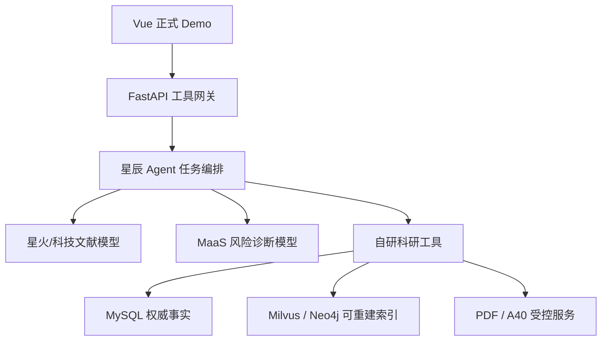

# 科大 Agent 方案设计

> 版本：2.0
> 更新日期：2026-07-22
> 状态：用户已审核的比赛技术基线
> 依据：`CONTEST_BASELINE.md`、`PROJECT_BLUEPRINT.md` 与 `REQUIREMENTS_ANALYSIS.md`

## 1. 设计结论

产品北极星不变：“面向 AI 科研新手的论文逆向工程与科研叙事训练”。

正式比赛主链路冻结为：

`Vue → FastAPI → 星辰 Agent → 星火/科技文献模型、MaaS → 自研结构化工具`

这是参赛技术策略，不是对官方准入条款的夸大。规则允许其他工具；但由于科大讯飞是发榜方，平台在官网
被重点推荐，且提交物明确支持 ServiceID，本项目不再把讯飞能力安排到最后做可选适配。

## 2. 三个工作台和黄金链路

| 工作台 | 核心问题 | 比赛版产物 |
| --- | --- | --- |
| 论文逆向工程 | 优秀论文为什么这样研究、实验、画图和叙事 | 叙事链、实验意图卡、图表角色卡、证据定位 |
| 领域进展地图 | 当前做到哪里，哪些结论可比，还缺什么 | 方法演进、数据集/指标矩阵、争议、候选研究机会 |
| 我的研究教练 | 用户的 Claim 还需要哪些证据 | 实验计划、图表计划、风险诊断、叙事骨架 |

主线对象是：

`Problem → ResearchGap → Hypothesis → Method → Claim → Experiment → Figure/Table → Evidence → Boundary`

三分钟 Demo 只展示“自然语言任务—星辰澄清—论文检索—逆向工程—图表/实验解释—候选机会—Claim诊断—证据回跳”，
不展示数据库管理、迁移、解析器基准或长篇开发状态。

## 3. 总体架构

核心原则：星辰负责理解和编排，星火负责科研语言理解与组织，自研工具负责事实、检索、计算、审计和证据。模型不能
越过工具契约构造核心科研对象。

## 4. 技术栈冻结与当前差距

| 层 | 冻结目标 | 当前仓库真值 | 结论 |
| --- | --- | --- | --- |
| 前端 | Vue 3 + TypeScript + Vite + Element Plus + Pinia | Vue/TS/Vite已有；Element Plus、Pinia尚未安装 | 待在界面重构任务中引入，不为追求栈一次性翻新 |
| 可视化 | Cytoscape.js | 当前是自研DOM/SVG证据图 | 待完成叙事图数据契约后替换 |
| API | FastAPI + Pydantic + SQLAlchemy 2 | 已有 | 保留 |
| 异步任务 | Celery + Redis | 当前未实现 | 只用于PDF解析、批量嵌入、实验和长模型任务 |
| 事实库 | MySQL 8.4 | 已有模型、迁移和可选持久化 | 唯一权威事实源 |
| 检索 | Milvus 2.6.x，BM25 + BGE-M3 Dense + RRF + BGE Reranker | 默认`demo` + `hash`；依赖上限仍允许2.5 | P0真实RAG缺口 |
| 图谱 | Neo4j Community | 已有同步与查询，但节点/关系契约与目标不同 | 由MySQL重建，完成8节点10关系迁移 |
| Agent | 星辰正式工作流 | HTTP适配和Mock已有，无线上证据 | P0发布阻断 |
| 模型 | 星火/科技文献模型 | 默认离线规则 | P0真实联调缺口 |
| 微调 | 星火 MaaS | 无数据、ServiceID和对比 | P0缺口 |
| 计算 | A40受控时序实验服务 | 有结果清单/绘图基础，无完整任务服务 | P1，不阻塞首个Agent闭环 |

## 5. 最终技术边界

| 能力 | 唯一实现位置 | 输入/输出和门禁 |
| --- | --- | --- |
| 用户意图、歧义澄清、任务路由 | 星辰 Agent | 输出结构化`intent/slots/next_action`；缺参数必须追问 |
| 三工作台编排 | 星辰 Agent | 只调用白名单工具；保留工作流版本和`trace_id` |
| 科研语言理解与报告组织 | 星火/科技文献模型 | 只根据工具结果组织语言；引用必须通过EvidenceAnchor门禁 |
| 垂类微调 | 星火 MaaS | 唯一任务：TAD实验协议风险诊断；提交ServiceID、曲线和前后对比 |
| 论文解析、混合检索、重排 | 自研 FastAPI | 解析与检索不直接升格为科研判断 |
| Claim—Evidence叙事图 | 自研 MySQL + Neo4j | MySQL为事实，Neo4j只是可重建路径索引 |
| 候选创新机会审计 | 自研规则/工具，被Agent调用 | 同时输出支持/反对证据、覆盖、置信度与人工确认项 |
| 时序实验执行 | 自研 A40 任务服务 | 只执行白名单配置；不从自然语言任意执行代码 |
| 引用与结论一致性 | 自研工具 | 无证据结论、过度结论和不可比数值必须拦截 |
| 证据图谱、实验曲线、PDF回跳 | 自研 Vue + Cytoscape.js | 显示数据/工作流/模型版本和审核状态 |
| 模型与系统评测 | MaaS评测 + 自研Gold评测 | 同时证明平台使用和产品内容可信 |

## 6. 星辰工作流设计

### 6.1 任务状态

`collecting_context → routing → running_tools → grounding → composing → awaiting_user | completed | insufficient_evidence | failed`

必填上下文是学习阶段、任务类型、论文/领域、时间范围和用户自有材料。缺失影响结果的字段时必须追问，不能默认猜测。

### 6.2 白名单工具

| 工具 | 接口 | 结构化结果 |
| --- | --- | --- |
| `search_papers` | `POST /api/v1/agent-tools/search-papers` | 论文、匹配理由、来源、审核状态、检索覆盖 |
| `deconstruct_paper` | `POST /api/v1/agent-tools/deconstruct-paper` | 叙事链、实验卡、图表卡、证据和边界 |
| `compare_papers` | `POST /api/v1/agent-tools/compare-papers` | 比较矩阵、不可比警告、支持/反对证据 |
| `diagnose_claim` | `POST /api/v1/agent-tools/diagnose-claim` | 缺失证据、实验/图表计划、风险和不能证明之处 |
| `audit_opportunity` | `POST /api/v1/agent-tools/audit-opportunity` | 候选机会、正反证据、覆盖、置信度、待确认项 |
| `run_tad_experiment` | `POST /api/v1/agent-tools/run-tad-experiment` | 任务ID、审核配置、运行清单和产物哈希 |

每个接口统一返回 `result` 、`sources`、`warnings`、`evidence_status`、`trace_id`、`tool_version`和 `data_version`。

当前代码已实现前四个接口及Bearer门禁，契约见`docs/astron/agent-tools.openapi.yaml`；
`audit_opportunity`和`run_tad_experiment`仍是冻结目标，未实现，不得在星辰工具列表中注册为可用能力。

### 6.3 降级语义

- 星辰鉴权、超时或中断：显示`astron_unavailable`，可由用户选择转离线演示。
- 星火模型失败：保留工具结果，不显示伪造的模型综述。
- 检索或证据不足：返回`insufficient_evidence`，不用通识补全。
- 离线规则：始终标记`offline_rule`，不计入正式星辰/星火效果。

## 7. RAG 实现

1. Bronze/Silver/Gold 文档在 MySQL 记录来源、许可、哈希、语料版本和审核状态。
2. 分块单位优先为章节、段落、Figure/Table图注、表格和引用语境，保留页码和版面定位。
3. Milvus 2.6.x 同时建立 BM25 与 BGE-M3 Dense 索引。
4. 两路召回经 RRF 融合，再由 BGE Reranker 重排。
5. 应答只消费保留来源的候选块；显示检索计划、入选理由、范围和可能遗漏。
6. 评测 Recall@K、MRR、nDCG@K、引用准确率、无证据结论率与 P50/P95。

## 8. MySQL、Milvus 与 Neo4j

### 8.1 责任

- MySQL 8.4：唯一权威事实源；管理论文、来源、审核、叙事对象、EvidenceAnchor、用户项目、运行与模型版本。
- Milvus：可重建文本/多模态检索索引；不保存唯一业务事实。
- Neo4j：可重建叙事路径与一至三跳查询索引；不独立接受人工修改。

MySQL 写入失败时禁止同步索引；Milvus/Neo4j 失败时记录`partial`并可重建。

### 8.2 固定八类节点

1. `Paper`
2. `Problem`
3. `ResearchGap`
4. `Method`
5. `Claim`（`claim_type` 覆盖 Hypothesis、Contribution、Limitation 等）
6. `Experiment`
7. `Artifact`（Figure/Table 子类型）
8. `EvidenceAnchor`

`NarrativeMove` 继续在 MySQL 作为叙事顺序和教学解释对象，不再作为第九种 Neo4j 业务节点。

### 8.3 固定十类关系

1. `Paper -HAS_PROBLEM→ Problem`
2. `Problem -HAS_GAP→ ResearchGap`
3. `ResearchGap -MOTIVATES→ Method`
4. `Paper -PROPOSES→ Method`
5. `Method -MAKES_CLAIM→ Claim`
6. `Claim -TESTED_BY→ Experiment`
7. `Experiment -PRESENTED_AS→ Artifact`
8. `Artifact -SUPPORTS→ Claim`
9. `Claim -SUPPORTED_BY→ EvidenceAnchor`
10. `Problem|ResearchGap|Method|Experiment|Artifact -GROUNDED_IN→ EvidenceAnchor`

第10类是允许多种源节点的统一证据关系，不算多个关系类型。跨论文的继承、冲突和不可比判断先作为有证据的比较结果，
不在比赛前扩大固定图谱语义。

## 9. MaaS 微调和 A40 实验

### 9.1 微调任务

唯一任务是“时间序列异常检测实验协议风险诊断”，不训练通用论文生成模型。

- 输入：Claim、数据集/划分、预处理、基线、指标、point-adjustment、参数选择和已有证据。
- 输出：风险类型、严重度、定位、依据、修复建议、可以/不能支持的Claim。
- 常见风险：数据泄漏、不公平基线、不同指标口径、队列分割错误、过度调参、缺失消融/稳健性/效率证据。
- 验收：先冻结盲测集；比较基础模型与微调模型的风险F1、严重度一致率、引用正确率和无证据建议率。

### 9.2 实验资源

- 数据集：NASA SMAP、NASA MSL、NAB 合法子集。
- 基线：稳健滑动 Z-score、Isolation Forest、LSTM Autoencoder。
- 任务服务：Celery/Redis 接收已审核配置，A40 执行；保存数据/代码/环境/随机种子/指标/产物哈希。
- 评价协议必须显示 point-wise/event-wise、point-adjustment、阈值选择、数据划分和预处理；口径不同时禁止直接排名。

## 10. 可信与安全

- `DocumentStructure` 只表示客观版面事实；`PaperDeconstruction` 表示人工复核或模型辅助的科研语义。
- 开放许可、用户私有副本或机构授权之外的PDF不持久化、不再分发、不提交Git。
- 用户上传结果必须标记来源和哈希，不生成或美化科研数值。
- API密钥、ServiceID私密配置、真实身份映射、受限全文和构建产物不进入Git。
- 输出显示人工标注、模型抽取、开发种子、证据不足和正式结果的差异。

## 11. 评测与发布门禁

### 11.1 三个必测典型问题

1. Anomaly Transformer 为什么提出 Association Discrepancy，哪些实验支持它？
2. 指定主结果表/消融表/参数图为什么这样设计，能与不能证明什么？
3. 给定一个TAD研究假设，需要补哪些实验、图表与协议风险？

三题均必须同时经过Gold/人工验证、星辰真实trace、星火回答引用门禁和前端证据回跳。

### 11.2 发布门禁

- 5—10篇合法TAD Gold已进入流程，至少3篇冻结支撑正式问题。
- 星辰工作流已发布，3题有真实请求ID，超时、鉴权失败和证据不足语义正确。
- 星火/科技文献模型不产生无证据核心结论。
- MaaS提交 ServiceID、数据字典、训练曲线、基础/微调对比和失败类型。
- 至少2名真实目标用户完成结构化试用；先完成5人形成性测试，再开屐50+学生对照试验。
- 后端测试、前端生产构建、真实基础设施冒烟、密钥/许可扫描和三分钟真实交互视频全部通过。

## 12. 01—07 提交物实现对应

| 提交物 | 代码/产品证据 | 平台证据 | 管件人 |
| --- | --- | --- | --- |
| 01 参赛信息 | 团队、指导教师、联系方式与系统一致 | 无 | 队长 |
| 02 伦理与安全 | 隐私、许可、AI标识、学术诚信、密钥扫描 | 星辰/星火/MaaS数据与凭据说明 | 后端+数据 |
| 03 Demo | Vue正式地址、三工作台、证据回跳、降级态 | 星辰真实工作流 | 前端+后端 |
| 04 作品方案 | 北极星、差异化、架构、效果、迭代与商业化 | 平台分工、工作流和微调证据 | 产品+队长 |
| 05 代码/模型 | 仓库、锁定依赖、复现报告、Gold说明 | 工作流版本、模型/ServiceID、MaaS曲线 | 后端+算法 |
| 06 效果验证 | 3题准确性、2人真实试用、5/50+实验、3分钟视频 | 星辰trace、星火/MaaS前后对比 | 评测+产品 |
| 07 其他材料 | 测试脚本、错误案例、数据字典、用户原始记录脱敏版 | 平台配置清单与失败清单 | 评测+后端 |

`docs/SUBMISSION_TRACEABILITY.md` 是每周更新的提交物总账，本文只冻结实现原则。

## 13. 执行顺序

1. **P0-X1：星辰最小真实链路。** 用一个已有开发种子，完成澄清、调用单篇拆解工具、星火组织回答、证据门禁和Vue运行态。
2. **P0-D1：三题/三篇冻结Gold。** 与平台联调并行，不用开发种子充当正式内容。
3. **P0-R1：真实混合检索。** 实现 BM25 + BGE-M3 + RRF + BGE Reranker 和离线评测。
4. **P0-M1：MaaS风险诊断。** 先冻结数据契约和盲测集，再训练，最后接入研究教练。
5. **P0-U1：用户友好和效果证据。** 5人形成性测试、2人正式使用，再做50+对照实验。
6. **P1：多篇地图、A40实验和提交物收敛。** 只扩展能直接支撑黄金链路的能力。

在 P0-X1 和 P0-D1 完成前，暂停新PDF解析器、大量数据库迁移、知识图谱“大球”、通用权限/计费和与三题无关的页面。
